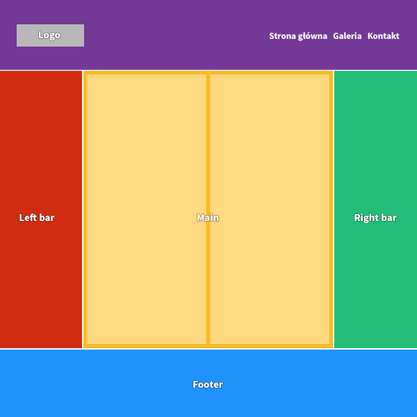
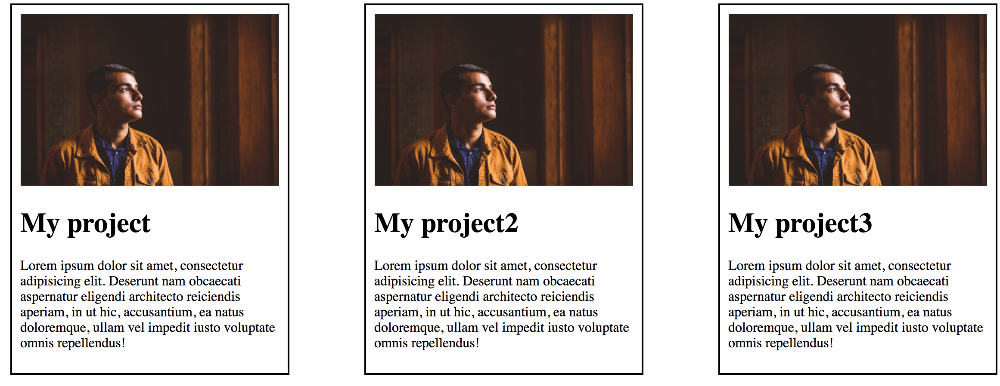

## Box z użytkownikiem - rozwiązywane z wykładowcą

> ### Przygotowanie
>
> Zmodyfikuj plik `vite.config.js` tak, aby zmienna `exercisePath` wskazywała na:
>
> - `05_Dzien_3/01_Flexbox/01_Box_z_uzytkownikiem`
>
> **Pamiętaj aby włączyć serwer deweloperski (`npm run dev`).**

Przy pomocy flexboxa stwórz poniższy element na stronie internetowej:

Wytyczne:

- Obrazek jest wycentrowany pionowo względem tekstu
- Przycisk `Wyślij wiadomość` znajduje się w prawym dolnym rogu boksa (użyj flexboxa).

## Holy Grail - rozwiązywane z wykładowcą

> ### Przygotowanie
>
> Zmodyfikuj plik `vite.config.js` tak, aby zmienna `exercisePath` wskazywała na:
>
> - `05_Dzien_3/01_Flexbox/02_Holy_Grail`
>
> **Pamiętaj aby włączyć serwer deweloperski (`npm run dev`).**

Holy Grail w CSS to nie słynny kielich tylko problem, który w przeszłości przysparzał zmarszczek nie jednemu developerowi.

Problem ten polegał na stworzeniu w pełni działającego layoutu, który opierałby się o równe kolumny.

Wykonanie takiego layoutu za pomocą floatów było nie lada wyzwaniem i pokazywało, czy dana osoba osiągnęła prawdziwy poziom Jedi w css.

Twoim celem będzie zrobienie poniższego layoutu (bez napisów określających elementy) za pomocą flexboxa:

## Flexbox Froggy

Ukończ grę Flexbox Froggy do której link znajdziesz tutaj: [https://flexboxfroggy.com/#pl](https://flexboxfroggy.com/#pl).

## Nawigacja

> ### Przygotowanie
>
> Zmodyfikuj plik `vite.config.js` tak, aby zmienna `exercisePath` wskazywała na:
>
> - `05_Dzien_3/01_Flexbox/04_Nawigacja`
>
> **Pamiętaj aby włączyć serwer deweloperski (`npm run dev`).**

Korzystając z wiedzy dotyczącej jak układać elementy na stronie wykonaj poniższy układ strony.

Wytyczne:

- Do ustawiania elementów obok siebie użyj flexboxa
- Logo i nawigacja muszą być rozstrzelone (czyli być maksymalnie oddalone od siebie)
- Logo i nawigacja muszą być na środku headera (wyśrodkowane w pionie)

Dodatkowe informacje:

- kolor tła: #E53C3D
- kolor tekstu: #492F41

## Boxy projektowe

> ### Przygotowanie
>
> Zmodyfikuj plik `vite.config.js` tak, aby zmienna `exercisePath` wskazywała na:
>
> - `05_Dzien_3/01_Flexbox/05_Boxy_projektowe`
>
> **Pamiętaj aby włączyć serwer deweloperski (`npm run dev`).**

Stwórz poniższą sekcję przy użyciu flexboxa:

## Ogniste koła

> ### Przygotowanie
>
> Zmodyfikuj plik `vite.config.js` tak, aby zmienna `exercisePath` wskazywała na:
>
> - `05_Dzien_3/01_Flexbox/06_Ogniste_kola`
>
> **Pamiętaj aby włączyć serwer deweloperski (`npm run dev`).**

Kolejnym zadaniem będzie odwzorowanie poniższej grafiki:

Stwórz w html element `.circles` (np. section), w którym umieścisz 6 kółek (np. jako divy). Każde kółko powinno mieć:

- rozmiar `150x150`
- wycentrowany w pionie i poziomie tekst (za pomocą flexboxa) o wielkości `40px`
- odstęp od innych kółek `10px`
- tło gradientowe przechodzące z czerwonego na kolor `#FBB921`

**Kółka powinny być wycentrowane w poziomie i zawijać się (spadać jedno pod drugie) jeżeli nie mieszczą się w poziomie.**
